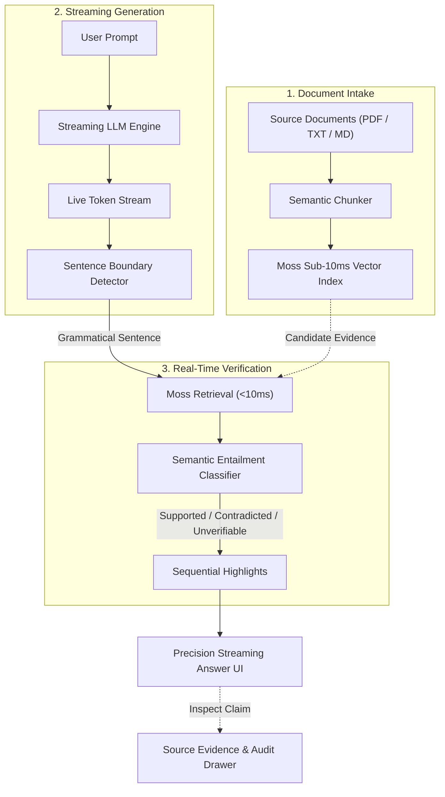

# Tripwire

**Real-Time, Sentence-Level Factual Verification Guardrail for Streaming LLM Output**

Tripwire intercepts streaming Large Language Model (LLM) responses and validates each factual claim against trusted source documents in real time. Unlike conventional post-generation evaluation frameworks that force users to wait for completion, Tripwire fact-checks sentence by sentence as tokens stream, rendering immediate visual verdicts before ungrounded assertions can cause cognitive anchoring.

---

## Architecture & Verification Flow

Tripwire pairs **Moss's sub-10ms semantic retrieval** with an independent semantic entailment classifier, embedding verification directly into the inter-token streaming window:



---

## What Sets Tripwire Apart

- **In-Stream Factual Verification**: Evaluates grammatical claims concurrently as tokens stream, eliminating the multi-second post-generation evaluation bottleneck.
- **"Similarity Is Not Truth" Safeguard**: Decouples retrieval from factual judgment. High vector similarity does not imply agreement—Tripwire detects subtle direction flips (*"increased"* vs. *"decreased"*) and altered metrics that standard RAG systems falsely trust.
- **Sub-10ms Moss Retrieval Layer**: Leverages Moss to resolve independent, per-sentence vector queries in single-digit milliseconds, keeping pace with raw LLM generation.
- **Ordered Progressive Rendering**: Even with parallelized background retrieval and classification, visual highlights resolve in strict reading order to prevent visual jitter.
- **Transparent A/B Latency Benchmarking**: Integrated side-by-side mode comparing Moss against an un-mocked brute-force vector scan, instrumented with real microsecond clocks.
- **Adversarial Stress-Testing Mode**: Built-in adversarial evaluation engine that dynamically mutates numbers and trend polarities to stress-test real-time hallucination catch rates.
- **Interactive Citation & Audit Inspector**: Direct click-to-inspect citations displaying source document passages, page numbers, character offsets, and contradiction explanations.

---

## Tech Stack Overview

- **Core Framework**: Next.js (App Router) & React (Server-Sent Events streaming)
- **Language & Runtime**: TypeScript & Node.js
- **Retrieval Engine**: `@moss-dev/moss` (Sub-10ms vector indexing and query execution)
- **Language Models**: Google Gemini API via `@google/genai` (Streaming generation & semantic entailment)
- **Document Processing**: Pure Node.js streaming parser & `pdf-parse`
- **Client State & Audit**: Client-side IndexedDB for zero-database session persistence

---

## System Architecture Overview

Tripwire is organized into a clean decoupled pipeline:
- **Client Workspace**: Manages token streaming, live sentence boundary detection, ordered claim rendering, and interactive source inspection.
- **API Edge Endpoints**: Handles document session ingestion (`/api/session`), live streaming token generation (`/api/generate`), per-sentence verification (`/api/verify`), and automated contradiction explanation (`/api/explain`).
- **Core Pipeline Engine**: Modularized retrieval, baseline cosine benchmarking, semantic entailment scoring, and resilient multi-key failover.

---

## Getting Started

### Prerequisites

- **Node.js**: Version 20.0.0 or higher
- **npm**, **pnpm**, or **yarn**
- **Google Gemini API Key**: [Google AI Studio](https://aistudio.google.com/)
- **Moss Credentials**: [Moss Developer Portal](https://moss.dev/)

### Configuration

Create a `.env` file in the project root:

```env
# Gemini API Configuration
GEMINI_API_KEY_1=your_primary_gemini_api_key
GEMINI_API_KEY_2=your_secondary_gemini_api_key

GEMINI_GENERATION_MODEL=gemini-3.6-flash
GEMINI_VERDICT_MODEL=gemini-3.6-flash
GEMINI_EXPLANATION_MODEL=gemini-3.6-flash

# Moss Retrieval Credentials
MOSS_PROJECT_ID=your_moss_project_id
MOSS_PROJECT_KEY=your_moss_project_key
```

### Installation & Run

```bash
# Install dependencies
npm install

# Run development server
npm run dev

# Build for production
npm run build
npm run start
```

---

## License

This project is licensed under the Apache 2.0 License.
