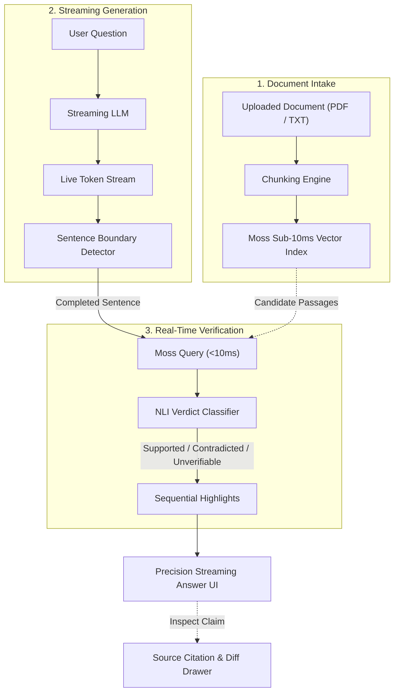

# Tripwire

**Real-Time, Sentence-Level Hallucination Detection for Streaming LLM Output**

Tripwire intercepts streaming Large Language Model (LLM) responses and verifies each factual claim against a source document in real time. Rather than relying on post-generation evaluation frameworks, Tripwire fact-checks sentence by sentence as tokens stream, rendering immediate visual verdicts before incorrect statements can cause cognitive anchoring.

---

## Architecture & Verification Flow

Tripwire leverages **Moss's sub-10ms semantic retrieval** to fit retrieval and classification directly inside the natural inter-token streaming window:



---

## Core Principles

- **Similarity Is Not Truth**: Vector search finds candidate passages; it cannot determine factual validity. Contradictions (e.g., *"revenue grew 10%"* vs. *"revenue fell 10%"*) score high similarity. An NLI classification step cross-examines numbers, directions, and dates before assigning a verdict.
- **Fresh Queries Per Sentence**: Each completed sentence issues its own fresh, isolated retrieval query against the entire source document to catch external hallucinations and drift.
- **Fail-Safe Default**: Any network failure, rate limit, or ambiguous source coverage strictly resolves to **Amber** (`UNVERIFIABLE`). The system never falsely reports an unverified claim as verified (**Green**).
- **Authentic Clock Telemetry**: Every latency number is captured using high-resolution `performance.now()` clocks around real computation—including the un-mocked brute-force cosine baseline.
- **Ordered Progressive Rendering**: Verification calls run concurrently, but highlights reveal strictly in reading order to prevent visual flickering.

---

## Key Features

- **Inline Sentence Boundary Detection**: Client-side tokenizer identifies completed grammatical sentences on the fly as tokens stream.
- **Sub-10ms Retrieval Layer**: Integrated `@moss-dev/moss` vector search retrieves source candidates within single-digit milliseconds.
- **4-Tier Precision Highlighting**: Live visual feedback—**Green** (Supported), **Red** (Contradicted), **Amber** (Unverifiable), and **Grey** (Non-factual statements/transitions).
- **Source Inspection Drawer**: Click any verified sentence to view the exact source passage, page number, character offsets, and contradiction reasoning.
- **Live A/B Latency Comparison**: Real-time toggle comparing Moss with an in-memory brute-force cosine baseline, complete with microsecond telemetry.
- **Resilient Multi-Key Failover**: Automated API key cycling, backoff, and fallback models protect against upstream provider rate limits.
- **Zero-Database Persistence**: Client-side IndexedDB stores audit trails and conversation history locally with zero external database dependencies.

---

## Technology Stack

| Layer | Technology | Purpose |
|---|---|---|
| **Framework** | Next.js 16 (App Router, Turbopack) | Server-rendered frontend and high-performance API routes |
| **Runtime** | Node.js 20+ / TypeScript 5 | End-to-end type safety and asynchronous pipeline execution |
| **Frontend** | React 19, Tailwind CSS v4, Lucide | Streaming typography, animations, and tactile dark UI |
| **Retrieval Engine** | `@moss-dev/moss` | Sub-10ms semantic vector indexing and query execution |
| **Language Models** | Google Gemini (`@google/genai`) | Whole-document stuffed generation, verdict classification, and explanation |
| **Document Intake** | `pdf-parse` & UTF-8 Text Extractors | Multi-page PDF, TXT, and Markdown parsing |
| **Client Storage** | IndexedDB (`lib/storage.ts`) | Zero-footprint session caching and conversation history |

---

## Project Structure

Tripwire is structured as a modular Next.js application:

- **`src/app/`**: Next.js App Router workspace (`/agent`) and API routes (`/api/session`, `/api/generate`, `/api/verify`, `/api/explain`).
- **`src/components/`**: UI components including the streaming QA thread, citation inspection drawer, top telemetry bar, and upload view.
- **`src/lib/`**: Pipeline internals—Moss integration, streaming sentence boundary detector, NLI classifier, baseline comparison engine, and IndexedDB storage.
- **`docs/`**: Architectural specifications, formal PRD, state machine definitions, and tech stack validation.

---

## Getting Started

### Prerequisites

- **Node.js**: Version 20.0.0 or higher
- **npm** or **pnpm**
- **Google Gemini API Key**: Acquired via [Google AI Studio](https://aistudio.google.com/)
- **Moss Project Credentials**: Acquired via [Moss](https://moss.dev/)

### Environment Configuration

Create a `.env` file in the project root:

```bash
cp .env.example .env
```

Populate the required credentials:

```env
# Google Gemini API Keys (Multi-key failover supported)
GEMINI_API_KEY_1=your_primary_gemini_api_key
GEMINI_API_KEY_2=your_secondary_gemini_api_key

# Models
GEMINI_GENERATION_MODEL=gemini-3.6-flash
GEMINI_VERDICT_MODEL=gemini-3.1-flash-lite
GEMINI_EXPLANATION_MODEL=gemini-3.1-flash-lite
GEMINI_EMBEDDING_MODEL=gemini-embedding-2

# Moss Retrieval Credentials
MOSS_PROJECT_ID=your_moss_project_id
MOSS_PROJECT_KEY=your_moss_project_key
```

### Installation & Execution

```bash
# 1. Install dependencies
npm install

# 2. Run local development server
npm run dev

# 3. Production build
npm run build
npm run start

# 4. Code quality checks
npm run lint
npx tsc --noEmit
```

---

## License

This project is licensed under the Apache 2.0 License.
