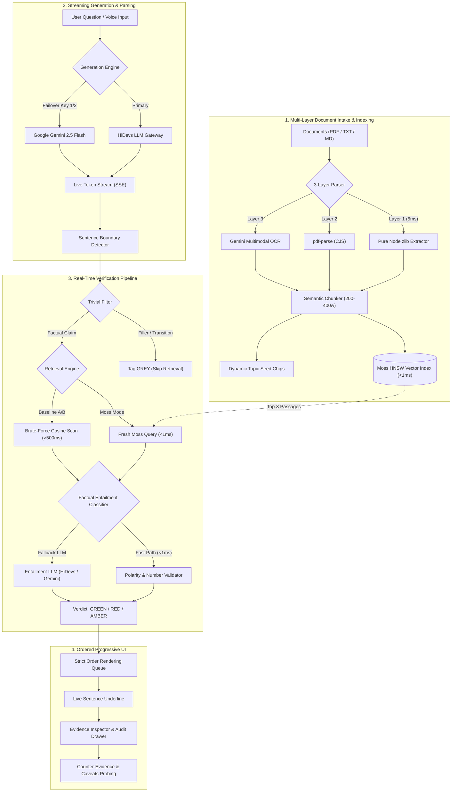
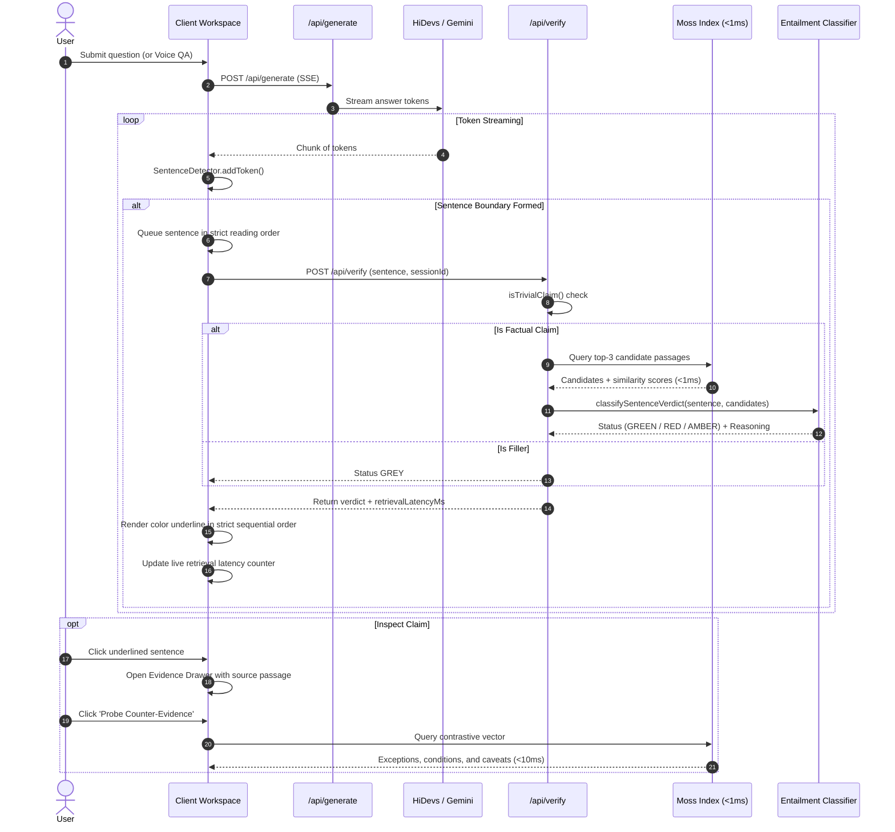

# Tripwire

**Real-Time, Sentence-Level Factual Verification Guardrail for Streaming LLM Output**

Tripwire intercepts streaming Large Language Model (LLM) responses and validates each factual claim against trusted source documents in real time. Unlike conventional post-generation evaluation frameworks that force users to wait for completion, Tripwire fact-checks sentence by sentence as tokens stream, rendering immediate visual verdicts before ungrounded assertions can cause cognitive anchoring.

---

## Architecture & End-to-End Flow

Tripwire pairs **Moss's sub-10ms semantic retrieval** with an independent factual entailment classifier, embedding verification directly into the inter-token streaming window:


```mermaid
flowchart TD
    subgraph Ingestion ["1. Multi-Layer Document Intake & Indexing"]
        DOC["Documents (PDF / TXT / MD)"] --> PARSE{"3-Layer Parser"}
        PARSE -->|"Layer 1 (5ms)"| PURE_NODE["Pure Node zlib Extractor"]
        PARSE -->|"Layer 2"| PDF_PARSE["pdf-parse (CJS)"]
        PARSE -->|"Layer 3"| GEMINI_OCR["Gemini Multimodal OCR"]
        PURE_NODE --> CHUNKER["Semantic Chunker (200-400w)"]
        PDF_PARSE --> CHUNKER
        GEMINI_OCR --> CHUNKER
        CHUNKER --> MOSS_IDX[("Moss HNSW Vector Index (<1ms)")]
        CHUNKER --> SEED["Dynamic Topic Seed Chips"]
    end

    subgraph Generation ["2. Streaming Generation & Parsing"]
        USER["User Question / Voice Input"] --> GEN{"Generation Engine"}
        GEN -->|"Primary"| HIDEVS["HiDevs LLM Gateway"]
        GEN -->|"Failover Key 1/2"| GEMINI_GEN["Google Gemini 2.5 Flash"]
        HIDEVS --> TOKENS["Live Token Stream (SSE)"]
        GEMINI_GEN --> TOKENS
        TOKENS --> BOUNDARY["Sentence Boundary Detector"]
    end

    subgraph Verification ["3. Real-Time Verification Pipeline"]
        BOUNDARY --> FILTER{"Trivial Filter"}
        FILTER -->|"Filler / Transition"| GREY["Tag GREY (Skip Retrieval)"]
        FILTER -->|"Factual Claim"| RETRIEVE{"Retrieval Engine"}
        RETRIEVE -->|"Moss Mode"| MOSS_Q["Fresh Moss Query (<1ms)"]
        RETRIEVE -->|"Baseline A/B"| COSINE["Brute-Force Cosine Scan (>500ms)"]
        MOSS_IDX -.->|"Top-3 Passages"| MOSS_Q
        MOSS_Q --> CLASSIFIER{"Factual Entailment Classifier"}
        COSINE --> CLASSIFIER
        CLASSIFIER -->|"Fast Path (<1ms)"| FAST_CHECK["Polarity & Number Validator"]
        CLASSIFIER -->|"Fallback LLM"| LLM_VERDICT["Entailment LLM (HiDevs / Gemini)"]
        FAST_CHECK --> VERDICT["Verdict: GREEN / RED / AMBER"]
        LLM_VERDICT --> VERDICT
    end

    subgraph UI ["4. Ordered Progressive UI"]
        VERDICT --> QUEUE["Strict Order Rendering Queue"]
        QUEUE --> HIGHLIGHT["Live Sentence Underline"]
        HIGHLIGHT --> DRAWER["Evidence Inspector & Audit Drawer"]
        DRAWER --> COUNTER_EV["Counter-Evidence & Caveats Probing"]
    end
```

---

## Sentence-Level Lifecycle (Sequence Diagram)


```mermaid
sequenceDiagram
    autonumber
    actor User
    participant Frontend as Client Workspace
    participant StreamAPI as /api/generate
    participant LLM as HiDevs / Gemini
    participant VerifyAPI as /api/verify
    participant Moss as Moss Index (<1ms)
    participant Classifier as Entailment Classifier

    User->>Frontend: Submit question (or Voice QA)
    Frontend->>StreamAPI: POST /api/generate (SSE)
    StreamAPI->>LLM: Stream answer tokens
    loop Token Streaming
        LLM-->>Frontend: Chunk of tokens
        Frontend->>Frontend: SentenceDetector.addToken()
        alt Sentence Boundary Formed
            Frontend->>Frontend: Queue sentence in strict reading order
            Frontend->>VerifyAPI: POST /api/verify (sentence, sessionId)
            VerifyAPI->>VerifyAPI: isTrivialClaim() check
            alt Is Factual Claim
                VerifyAPI->>Moss: Query top-3 candidate passages
                Moss-->>VerifyAPI: Candidates + similarity scores (<1ms)
                VerifyAPI->>Classifier: classifySentenceVerdict(sentence, candidates)
                Classifier-->>VerifyAPI: Status (GREEN / RED / AMBER) + Reasoning
            else Is Filler
                VerifyAPI-->>Frontend: Status GREY
            end
            VerifyAPI-->>Frontend: Return verdict + retrievalLatencyMs
            Frontend->>Frontend: Render color underline in strict sequential order
            Frontend->>Frontend: Update live retrieval latency counter
        end
    end
    opt Inspect Claim
        User->>Frontend: Click underlined sentence
        Frontend->>Frontend: Open Evidence Drawer with source passage
        User->>Frontend: Click 'Probe Counter-Evidence'
        Frontend->>Moss: Query contrastive vector
        Moss-->>Frontend: Exceptions, conditions, and caveats (<10ms)
    end
```

---

## Core Features & Invariant Safeguards

| Feature | Description | PRD Spec |
| :--- | :--- | :--- |
| **In-Stream Verification** | Evaluates sentences concurrently as tokens stream—no post-generation wait. | FR-4, FR-5 |
| **Similarity Is Not Truth** | Vector similarity finds candidate passages; truth is judged independently. Catches direction flips (*rose* vs *fell*) and altered numbers. | Invariant 1, FR-8 |
| **Sub-10ms Moss Retrieval** | In-process HNSW vector search resolves per-sentence queries in single-digit milliseconds ($<1\text{ms}$ locally). | FR-3, FR-7 |
| **Fail-Safe Verdict Defaults** | On any timeout, network error, or rate limit, verdicts safely default to **AMBER** (never false GREEN). | Invariant 3, FR-8 |
| **Strict Ordered Rendering** | Highlight colors render strictly in reading sequence, even when parallel background calls resolve out of order. | Invariant 5, FR-9 |
| **Live Latency Meter** | Real-time counter tracks honest microsecond retrieval latency (e.g., `verified 12 claims · avg 0.8ms`). | FR-9 |
| **Transparent A/B Toggle** | Live side-by-side comparison of Moss ($<1\text{ms}$) vs un-mocked brute-force cosine scan ($>500\text{ms}$). | FR-12 |
| **Automatic Explanations** | Non-blocking secondary call generates single-line plain-English explanations for RED or AMBER flags. | FR-10 |
| **Evidence Audit Drawer** | Click any claim to inspect exact source document passages, page numbers, character offsets, and similarity scores. | FR-11 |
| **Counter-Evidence Engine** | Synthesizes contrast vectors to surface hidden exceptions, exemptions, and caveats for any claim in $<10\text{ms}$. | Showcase |
| **Spotlight Palette (`Cmd+K`)** | Instant document-wide semantic search powered by Moss with 1-click QA seeding and excerpt copying. | Showcase |
| **Dynamic Topic Seeds** | Auto-generates tailored analytical starter questions from document vector clusters on zero-state threads. | Showcase |
| **Adversarial Stress Test** | Live toggle mutating financial figures and metrics on the fly to test guardrail response live on stage. | Showcase |
| **Voice QA & Audio Agent** | Hands-free voice questioning via LiveKit / Deepgram STT, plus standalone real-time WebRTC audio agent (`/agent`). | Showcase |

---

## Tech Stack Overview

- **Core Framework**: [Next.js 16](https://nextjs.org/) (App Router & Turbopack) & [React 19](https://react.dev/)
- **Retrieval Engine**: [`@moss-dev/moss`](https://moss.dev/) (Sub-10ms in-process HNSW vector indexing and search)
- **Language Models & Gateways**:
  - Primary: HiDevs LLM Gateway (100k Credits for Hackathon Arena)
  - Automatic Multi-Key Failover: Google Gemini 2.5 Flash via [`@google/genai`](https://www.npmjs.com/package/@google/genai)
- **Speech & Audio**: LiveKit WebRTC (`livekit-server-sdk`, `@livekit/components-react`) & Deepgram STT
- **Styling & UI**: Tailwind CSS v4, Lucide Icons, and Framer Motion
- **Document Ingestion**: Pure Node.js `zlib` stream inflation (5ms native), `pdf-parse@1.1.4` (zero-worker CJS), Gemini Multimodal OCR
- **Testing & Quality Assurance**: Jest 30, ts-jest (68 automated invariant tests across 8 suites), ESLint 9

---

## Automated Invariant Test Suite

Tripwire enforces strict quality checks via an automated Jest test suite covering all critical product invariants:

```bash
npm run test:ci
```

```text
PASS __tests__/pdf.test.ts               (3-layer zero-worker document ingestion)
PASS __tests__/chunker.test.ts           (paragraph-aware semantic chunking)
PASS __tests__/sentence-boundary.test.ts (abbreviation & decimal boundary detection)
PASS __tests__/trivial-filter.test.ts    (filler/transition claim filtering)
PASS __tests__/moss.test.ts              (sub-10ms index creation and retrieval)
PASS __tests__/baseline.test.ts          (un-mocked brute-force cosine benchmark)
PASS __tests__/verdict-classifier.test.ts(FR-8 10/10 contradiction acceptance suite)
PASS __tests__/failover.test.ts          (multi-key failover and 503/429 parsing)

Test Suites: 8 passed, 8 total
Tests:       68 passed, 68 total
Snapshots:   0 total
```

---

## Getting Started

### Prerequisites

- **Node.js**: Version 20.0.0 or higher
- **npm**, **pnpm**, or **yarn**
- **HiDevs API Key** or **Google Gemini API Key**: [Google AI Studio](https://aistudio.google.com/)
- **Moss Credentials**: [Moss Developer Portal](https://moss.dev/)

### Environment Configuration

Create a `.env` file in the project root:

```env
# HiDevs LLM Gateway (Primary)
HIDEVS_API_KEY=your_hidevs_api_key
HIDEVS_BASE_URL=https://llm.hidevs.xyz/v1

# Google Gemini API Failover Keys
GEMINI_API_KEY_1=your_primary_gemini_api_key
GEMINI_API_KEY_2=your_secondary_gemini_api_key

GEMINI_GENERATION_MODEL=gemini-2.5-flash
GEMINI_VERDICT_MODEL=gemini-2.5-flash
GEMINI_EXPLANATION_MODEL=gemini-2.5-flash

# Moss Retrieval Credentials
MOSS_PROJECT_ID=your_moss_project_id
MOSS_PROJECT_KEY=your_moss_project_key

# Optional: Voice QA & Real-Time Audio Agent
LIVEKIT_API_KEY=your_livekit_api_key
LIVEKIT_API_SECRET=your_livekit_api_secret
LIVEKIT_URL=your_livekit_url
DEEPGRAM_API_KEY=your_deepgram_api_key
```

### Installation & Run

```bash
# 1. Install dependencies
npm install

# 2. Run automated test suite
npm run test:ci

# 3. Start development server
npm run dev

# 4. Production build
npm run build
npm run start
```

Visit [`http://localhost:3000`](http://localhost:3000) to launch the workspace.

---

## License

This project is licensed under the Apache 2.0 License.
