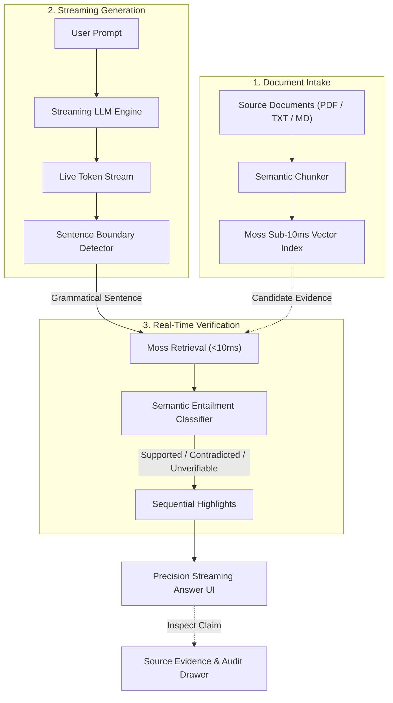

# Tripwire

**Real-Time, Sentence-Level Factual Verification Guardrail for Streaming LLM Output**

Tripwire intercepts streaming Large Language Model (LLM) responses and validates each factual claim against trusted source documents in real time. Unlike conventional post-generation evaluation frameworks that force users to wait for completion, Tripwire fact-checks sentence by sentence as tokens stream, rendering immediate visual verdicts before ungrounded assertions can cause cognitive anchoring.

---

## Architecture & Verification Flow

Tripwire pairs **Moss's sub-10ms semantic retrieval** with an independent semantic entailment classifier, embedding verification directly into the inter-token streaming window:


```mermaid
flowchart TD
    subgraph Ingestion ["1. Document Intake"]
        DOC["Source Documents (PDF / TXT / MD)"] --> CHUNK["Semantic Chunker"]
        CHUNK --> MOSS_IDX["Moss Sub-10ms Vector Index"]
    end

    subgraph Generation ["2. Streaming Generation"]
        USER["User Prompt"] --> LLM["Streaming LLM Engine"]
        LLM --> STREAM["Live Token Stream"]
        STREAM --> DETECT["Sentence Boundary Detector"]
    end

    subgraph Verification ["3. Real-Time Verification"]
        DETECT -->|"Grammatical Sentence"| MOSS_Q["Moss Retrieval (<10ms)"]
        MOSS_IDX -.->|"Candidate Evidence"| MOSS_Q
        MOSS_Q --> NLI["Semantic Entailment Classifier"]
        NLI -->|"Supported / Contradicted / Unverifiable"| VERDICT["Sequential Highlights"]
    end

    VERDICT --> UI["Precision Streaming Answer UI"]
    UI -.->|"Inspect Claim"| DRAWER["Source Evidence & Audit Drawer"]
```

---

## What Sets Tripwire Apart

- **In-Stream Factual Verification**: Evaluates grammatical claims concurrently as tokens stream, eliminating the multi-second post-generation evaluation bottleneck.
- **"Similarity Is Not Truth" Safeguard**: Decouples retrieval from factual judgment. High vector similarity does not imply agreement—Tripwire detects subtle direction flips (*"increased"* vs. *"decreased"*) and altered metrics that standard RAG systems falsely trust.
- **Sub-10ms Moss Retrieval Layer**: Leverages Moss to resolve independent, per-sentence vector queries in single-digit milliseconds, keeping pace with raw LLM generation.
- **Spotlight Semantic Palette (`Cmd+K`)**: Instant document-wide semantic search powered by Moss, featuring one-click QA prompt seeding and excerpt copying.
- **Counter-Evidence & Caveat Probing**: Synthesizes contrast vectors to surface hidden exceptions, limitations, and policy exemptions for any selected claim in <10ms.
- **Dynamic Topic Seed Chips**: Clusters document vectors on ingestion to generate 3 tailored analytical starter questions on zero-state threads.
- **Ordered Progressive Rendering**: Even with parallelized background retrieval and classification, visual highlights resolve in strict reading order to prevent visual jitter.
- **Transparent A/B Latency Benchmarking**: Integrated side-by-side mode comparing Moss against an un-mocked brute-force vector scan, instrumented with real microsecond clocks.
- **3-Layer Resilient Document Parsing**: Multi-tier extraction spanning `pdf-parse`, pure Node.js zlib stream inflation, and Gemini Multimodal OCR for scanned PDFs.
- **Interactive Citation & Audit Inspector**: Direct click-to-inspect citations displaying source document passages, page numbers, character offsets, and contradiction explanations.

---

## Tech Stack Overview

- **Core Framework**: Next.js 16 (App Router & Turbopack) & React 19 (Server-Sent Events streaming)
- **Language & Runtime**: TypeScript & Node.js
- **Retrieval Engine**: `@moss-dev/moss` (Sub-10ms in-process HNSW vector indexing and search)
- **Language Models**: Google Gemini 2.5 Flash via `@google/genai` (Streaming generation & CRISPE entailment)
- **Session & Caching**: In-Memory session registry with Upstash Redis rehydration
- **Styling**: Tailwind CSS v4 & Lucide Icons
- **Verification Suite**: Jest 30 & ts-jest with 67+ automated invariant tests

---

## System Architecture Overview

Tripwire is organized into a clean decoupled pipeline:
- **Client Workspace**: Manages token streaming, live sentence boundary detection, ordered claim rendering, Spotlight search modal, and interactive source inspection.
- **API Edge Endpoints**: Handles document session ingestion (`/api/session`), live streaming token generation (`/api/generate`), per-sentence verification (`/api/verify`), semantic search (`/api/search`), counter-evidence probing (`/api/counter-evidence`), automated contradiction explanation (`/api/explain`), and voice transcription (`/api/transcribe`).
- **Core Pipeline Engine**: Modularized retrieval, baseline cosine benchmarking, CRISPE semantic entailment scoring, and resilient multi-key failover.

---

## Getting Started

### Prerequisites

- **Node.js**: Version 20.0.0 or higher
- **npm**, **pnpm**, or **yarn**
- **Google Gemini API Key**: [Google AI Studio](https://aistudio.google.com/)
- **Moss Credentials**: [Moss Developer Portal](https://moss.dev/)

### Configuration

Create a `.env` file in the project root:

```env
# Gemini API Configuration
GEMINI_API_KEY_1=your_primary_gemini_api_key
GEMINI_API_KEY_2=your_secondary_gemini_api_key

GEMINI_GENERATION_MODEL=gemini-3.6-flash
GEMINI_VERDICT_MODEL=gemini-3.6-flash
GEMINI_EXPLANATION_MODEL=gemini-3.6-flash

# Moss Retrieval Credentials
MOSS_PROJECT_ID=your_moss_project_id
MOSS_PROJECT_KEY=your_moss_project_key
```

### Installation & Run

```bash
# Install dependencies
npm install

# Run development server
npm run dev

# Run automated invariant tests
npm test

# Build for production
npm run build
npm run start
```

---

## License

This project is licensed under the Apache 2.0 License.
