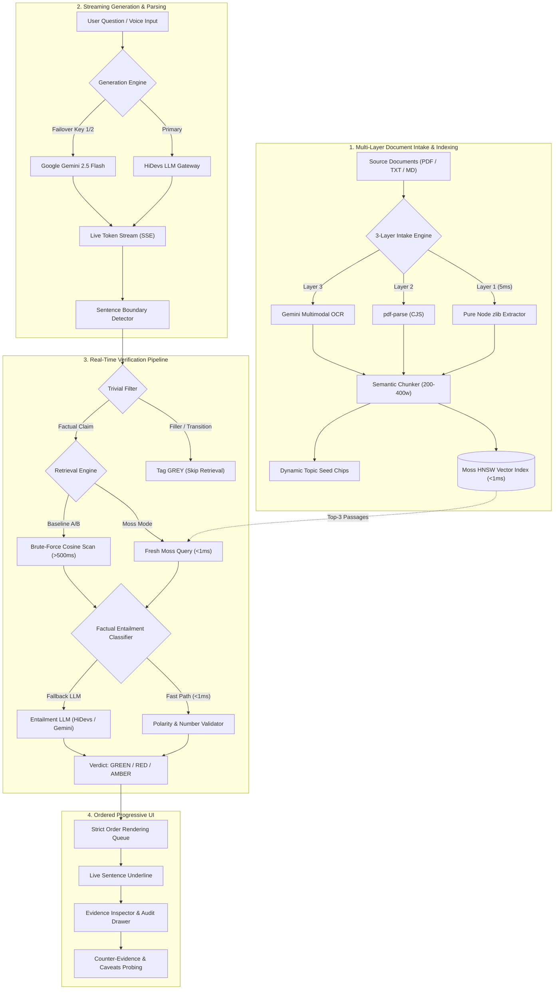

# Tripwire

**Real-Time, Sentence-Level Factual Verification Guardrail for Streaming LLM Output**

Tripwire intercepts streaming Large Language Model (LLM) responses and validates each factual claim against trusted source documents in real time. Unlike conventional post-generation evaluation frameworks that force users to wait for completion, Tripwire fact-checks sentence by sentence as tokens stream, rendering immediate visual verdicts before ungrounded assertions can cause cognitive anchoring.

---

## Architecture & Verification Flow

Tripwire pairs **Moss's sub-10ms semantic retrieval** with an independent factual entailment classifier, embedding verification directly into the inter-token streaming window:


```mermaid
flowchart TD
    subgraph Ingestion ["1. Multi-Layer Document Intake & Indexing"]
        DOC["Source Documents (PDF / TXT / MD)"] --> PARSE{"3-Layer Intake Engine"}
        PARSE -->|"Layer 1 (5ms)"| PURE_NODE["Pure Node zlib Extractor"]
        PARSE -->|"Layer 2"| PDF_PARSE["pdf-parse (CJS)"]
        PARSE -->|"Layer 3"| GEMINI_OCR["Gemini Multimodal OCR"]
        PURE_NODE --> CHUNKER["Semantic Chunker (200-400w)"]
        PDF_PARSE --> CHUNKER
        GEMINI_OCR --> CHUNKER
        CHUNKER --> MOSS_IDX[("Moss HNSW Vector Index (<1ms)")]
        CHUNKER --> SEED["Dynamic Topic Seed Chips"]
    end

    subgraph Generation ["2. Streaming Generation & Parsing"]
        USER["User Question / Voice Input"] --> GEN{"Generation Engine"}
        GEN -->|"Primary"| HIDEVS["HiDevs LLM Gateway"]
        GEN -->|"Failover Key 1/2"| GEMINI_GEN["Google Gemini 2.5 Flash"]
        HIDEVS --> TOKENS["Live Token Stream (SSE)"]
        GEMINI_GEN --> TOKENS
        TOKENS --> BOUNDARY["Sentence Boundary Detector"]
    end

    subgraph Verification ["3. Real-Time Verification Pipeline"]
        BOUNDARY --> FILTER{"Trivial Filter"}
        FILTER -->|"Filler / Transition"| GREY["Tag GREY (Skip Retrieval)"]
        FILTER -->|"Factual Claim"| RETRIEVE{"Retrieval Engine"}
        RETRIEVE -->|"Moss Mode"| MOSS_Q["Fresh Moss Query (<1ms)"]
        RETRIEVE -->|"Baseline A/B"| COSINE["Brute-Force Cosine Scan (>500ms)"]
        MOSS_IDX -.->|"Top-3 Passages"| MOSS_Q
        MOSS_Q --> CLASSIFIER{"Factual Entailment Classifier"}
        COSINE --> CLASSIFIER
        CLASSIFIER -->|"Fast Path (<1ms)"| FAST_CHECK["Polarity & Number Validator"]
        CLASSIFIER -->|"Fallback LLM"| LLM_VERDICT["Entailment LLM (HiDevs / Gemini)"]
        FAST_CHECK --> VERDICT["Verdict: GREEN / RED / AMBER"]
        LLM_VERDICT --> VERDICT
    end

    subgraph UI ["4. Ordered Progressive UI"]
        VERDICT --> QUEUE["Strict Order Rendering Queue"]
        QUEUE --> HIGHLIGHT["Live Sentence Underline"]
        HIGHLIGHT --> DRAWER["Evidence Inspector & Audit Drawer"]
        DRAWER --> COUNTER_EV["Counter-Evidence & Caveats Probing"]
    end
```

---

## What Sets Tripwire Apart

- **In-Stream Factual Verification**: Evaluates grammatical claims concurrently as tokens stream, eliminating the multi-second post-generation evaluation bottleneck.
- **"Similarity Is Not Truth" Safeguard**: Decouples retrieval from truth-judgment. High vector similarity does not imply agreement—Tripwire detects direction flips (*"increased"* vs. *"decreased"*) and altered numbers that standard RAG systems falsely trust.
- **Sub-10ms Moss Retrieval Layer**: Leverages Moss to resolve independent, per-sentence vector queries in single-digit milliseconds ($<1\text{ms}$ locally), keeping pace with raw LLM generation.
- **Dual-Path Factual Entailment**: Instant sub-millisecond in-memory validation for directional and numerical consistency, paired with an LLM classifier for complex semantic entailment.
- **Ordered Progressive Rendering**: Even with parallelized background retrieval and classification, visual highlights resolve in strict reading order to eliminate visual jitter.
- **Live Latency Telemetry**: Real-time counter tracks honest microsecond retrieval latency (e.g., `verified 12 claims · avg 0.8ms`).
- **Transparent A/B Latency Benchmarking**: Integrated side-by-side mode comparing Moss against an un-mocked brute-force vector scan, instrumented with real microsecond clocks.
- **Automated Mismatch Explanations**: Non-blocking secondary call generates single-line plain-English explanations for flagged claims without delaying stream rendering.
- **Interactive Citation & Audit Drawer**: Direct click-to-inspect citations displaying source document passages, page numbers, character offsets, and similarity scores.
- **Spotlight Semantic Palette (`Cmd+K` / `Ctrl+K`)**: Instant document-wide semantic search powered by Moss, featuring one-click QA prompt seeding and excerpt copying.
- **Counter-Evidence & Caveat Probing**: Synthesizes contrast vectors to surface hidden exceptions, limitations, and policy exemptions for any selected claim in $<10\text{ms}$.
- **Dynamic Topic Seed Chips**: Clusters document vectors on ingestion to generate tailored analytical starter questions on zero-state threads.
- **Adversarial Stress Test Mode**: On-the-fly mutation of financial metrics to test the guardrail against adversarial hallucinations live on stage.
- **Voice QA & Real-Time Audio Agent**: Hands-free voice questioning via LiveKit / Deepgram STT, plus a standalone real-time WebRTC audio agent (`/agent`).
- **3-Layer Resilient Document Parsing**: Multi-tier extraction spanning pure Node.js zlib stream inflation (5ms native), zero-worker `pdf-parse`, and Gemini Multimodal OCR for scanned PDFs.

---

## Tech Stack Overview

- **Core Framework**: [Next.js 16](https://nextjs.org/) (App Router & Turbopack) & [React 19](https://react.dev/)
- **Retrieval Engine**: [`@moss-dev/moss`](https://moss.dev/) (Sub-10ms in-process HNSW vector indexing and search)
- **Language Models & Gateways**:
  - Primary: HiDevs LLM Gateway (100k Credits for Hackathon Arena)
  - Automatic Multi-Key Failover: Google Gemini 2.5 Flash via [`@google/genai`](https://www.npmjs.com/package/@google/genai)
- **Speech & Audio**: LiveKit WebRTC (`livekit-server-sdk`, `@livekit/components-react`) & Deepgram STT
- **Styling & UI**: Tailwind CSS v4, Lucide Icons, and Framer Motion
- **Document Ingestion**: Pure Node.js `zlib` stream inflation (5ms native), `pdf-parse@1.1.4` (zero-worker CJS), Gemini Multimodal OCR
- **Testing & Quality Assurance**: Jest 30, ts-jest (68 automated invariant tests across 8 suites), ESLint 9

---

## Automated Invariant Test Suite

Tripwire enforces strict quality checks via an automated Jest test suite covering all critical product invariants:

```bash
npm run test:ci
```

```text
PASS __tests__/pdf.test.ts               (3-layer zero-worker document ingestion)
PASS __tests__/chunker.test.ts           (paragraph-aware semantic chunking)
PASS __tests__/sentence-boundary.test.ts (abbreviation & decimal boundary detection)
PASS __tests__/trivial-filter.test.ts    (filler/transition claim filtering)
PASS __tests__/moss.test.ts              (sub-10ms index creation and retrieval)
PASS __tests__/baseline.test.ts          (un-mocked brute-force cosine benchmark)
PASS __tests__/verdict-classifier.test.ts(10/10 contradiction acceptance suite)
PASS __tests__/failover.test.ts          (multi-key failover and 503/429 parsing)

Test Suites: 8 passed, 8 total
Tests:       68 passed, 68 total
Snapshots:   0 total
```

---

## Getting Started

### Prerequisites

- **Node.js**: Version 20.0.0 or higher
- **npm**, **pnpm**, or **yarn**
- **HiDevs API Key** or **Google Gemini API Key**: [Google AI Studio](https://aistudio.google.com/)
- **Moss Credentials**: [Moss Developer Portal](https://moss.dev/)

### Environment Configuration

Create a `.env` file in the project root:

```env
# HiDevs LLM Gateway (Primary)
HIDEVS_API_KEY=your_hidevs_api_key
HIDEVS_BASE_URL=https://llm.hidevs.xyz/v1

# Google Gemini API Failover Keys
GEMINI_API_KEY_1=your_primary_gemini_api_key
GEMINI_API_KEY_2=your_secondary_gemini_api_key

GEMINI_GENERATION_MODEL=gemini-2.5-flash
GEMINI_VERDICT_MODEL=gemini-2.5-flash
GEMINI_EXPLANATION_MODEL=gemini-2.5-flash

# Moss Retrieval Credentials
MOSS_PROJECT_ID=your_moss_project_id
MOSS_PROJECT_KEY=your_moss_project_key

# Optional: Voice QA & Real-Time Audio Agent
LIVEKIT_API_KEY=your_livekit_api_key
LIVEKIT_API_SECRET=your_livekit_api_secret
LIVEKIT_URL=your_livekit_url
DEEPGRAM_API_KEY=your_deepgram_api_key
```

### Installation & Run

```bash
# 1. Install dependencies
npm install

# 2. Run automated test suite
npm run test:ci

# 3. Start development server
npm run dev

# 4. Production build
npm run build
npm run start
```

Visit [`http://localhost:3000`](http://localhost:3000) to launch the workspace.

---

## License

This project is licensed under the Apache 2.0 License.
